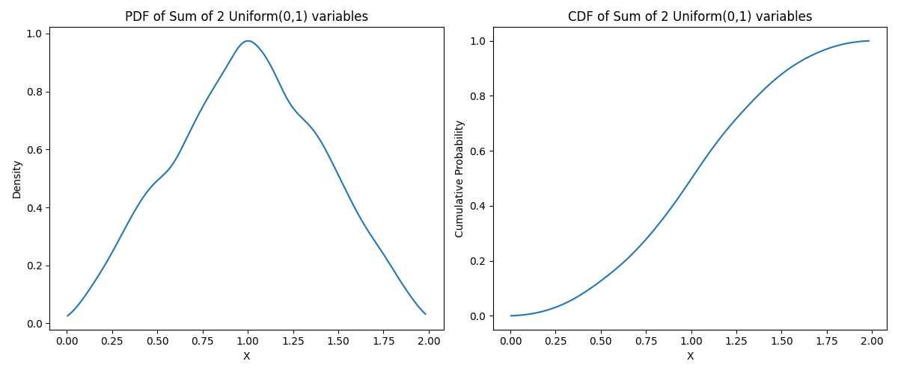
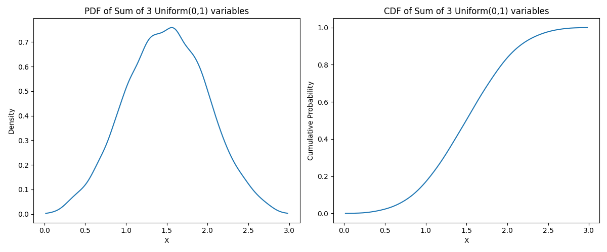
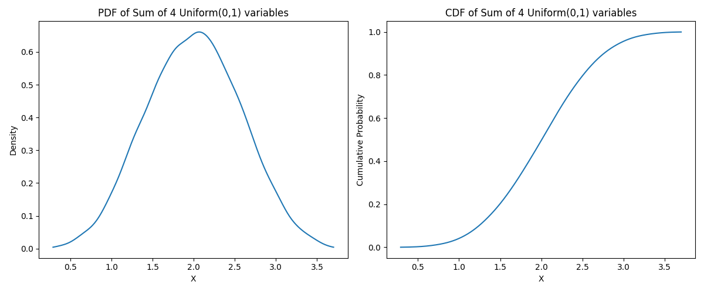
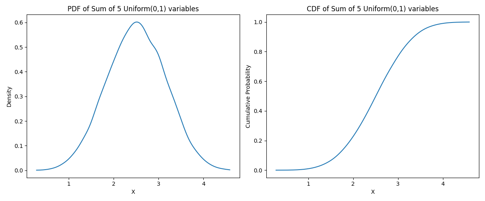
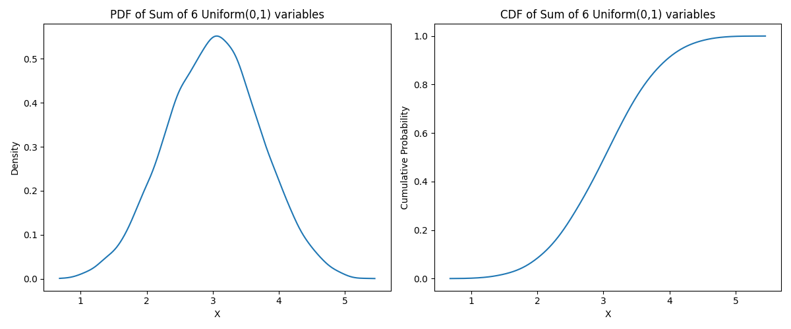
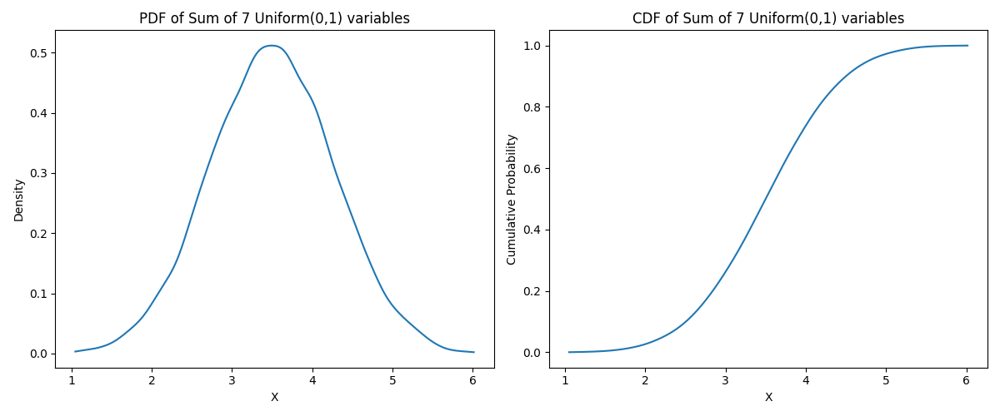
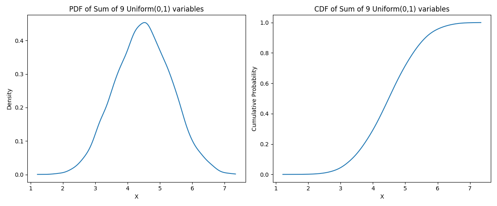
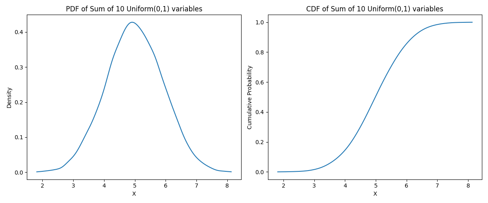
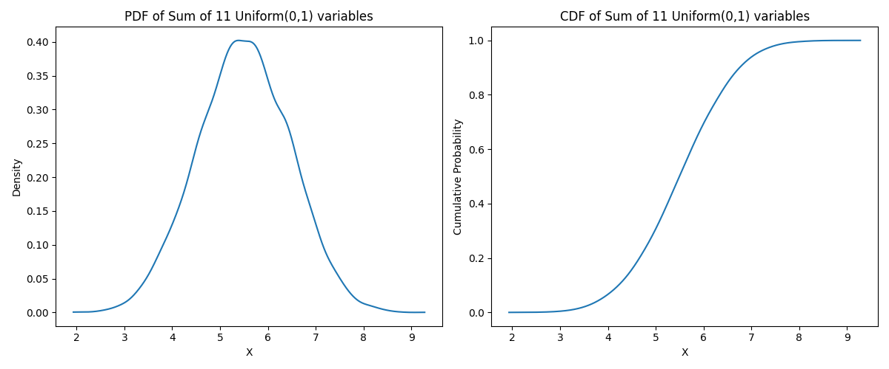
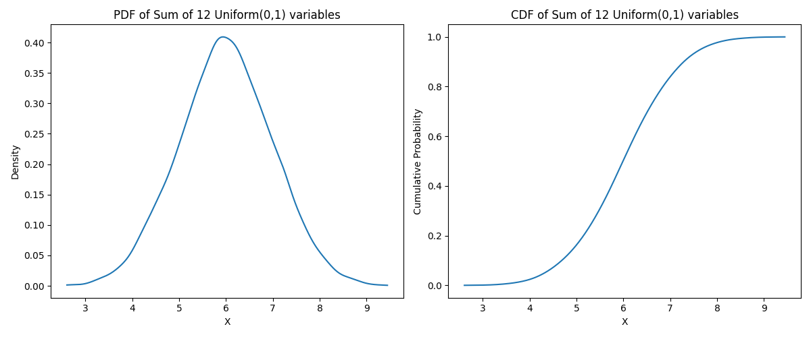

# 📘 Questão 1

```python
# Seja X a variável aleatória definida como a soma de n variáveis independentes e 
# uniformemente distribuídas no intervalo [0, 1] (X = X1 + X2 + ... + Xn).
# 
# Objetivo:
# - Desenvolver um programa que calcule:
#   • A média (E[X])
#   • A variância (Var[X])
#   • O segundo momento (E[X²])
# - Gerar os gráficos da função densidade de probabilidade (fX(x)) e da função
#   distribuição acumulada (FX(x)) para n = 1, 2, ..., 12.
#
# Tarefas de análise:
# - Verificar para qual distribuição X tende quando n aumenta.
# - Explicar por que isso ocorre (Teorema do Limite Central).
# - Identificar expressões gerais da média e da variância em função de n.
#
# Sugestão prática:
# - Utilizar 10.000 amostras para gerar cada sequência de variáveis aleatórias.
```

## 📊 Simulação: Soma de Variáveis Aleatórias Uniformes

Abaixo, é apresentado os resultados da simulação da soma de `n` variáveis aleatórias uniformemente distribuídas entre `0` e `1`. Para cada valor de `n` (de `1` a `12`), são exibidas:

* A média esperada `E[X]`;
* A variância `Var[X]`;
* O segundo momento `E[X²]`;
* Gráficos da *PDF* e da *CDF* obtidas via amostragem (`10.000` amostras por valor de `n`).

### 🔢 Resultados por Valor de `n`

#### n = 1

* **E\[X]** = `0.4935`;
* **Var\[X]** = `0.0836`;
* **E\[X²]** = `0.3270`;


#### n = 2

* **E\[X]** = `1.0012`;
* **Var\[X]** = `0.1634`;
* **E\[X²]** = `1.1657`;



#### n = 3

* **E\[X]** = `1.4963`;
* **Var\[X]** = `0.2465`;
* **E\[X²]** = `2.4856`;



#### n = 4

* **E\[X]** = `2.0049`;
* **Var\[X]** = `0.3299`;
* **E\[X²]** = `4.3495`;



#### n = 5

* **E\[X]** = `2.5046`;
* **Var\[X]** = `0.4198`;
* **E\[X²]** = `6.6930`;



#### n = 6

* **E\[X]** = `3.0124`;
* **Var\[X]** = `0.5077`;
* **E\[X²]** = `9.5825`;



#### n = 7

* **E\[X]** = `3.5017`;
* **Var\[X]** = `0.5858`;
* **E\[X²]** = `12.8480`;



#### n = 8

* **E\[X]** = `3.9944`;
* **Var\[X]** = `0.6610`;
* **E\[X²]** = `16.6163`;


#### n = 9

* **E\[X]** = `4.4905`;
* **Var\[X]** = `0.7561`;
* **E\[X²]** = `20.9211`;



#### n = 10

* **E\[X]** = `4.9942`;
* **Var\[X]** = `0.8535`;
* **E\[X²]** = `25.7953`;



#### n = 11

* **E\[X]** = `5.4974`;
* **Var\[X]** = `0.9351`;
* **E\[X²]** = `31.1565`;



#### n = 12

* **E\[X]** = `5.9965`;
* **Var\[X]** = `0.9864`;
* **E\[X²]** = `36.9448`;



## 🧪 Análise — Teorema Central do Limite

À medida que o valor de `n` aumenta, a distribuição da soma das variáveis aleatórias uniformes tende rapidamente para uma **distribuição normal**. Isso acontece em decorrência do **Teorema Central do Limite (*TCL*)**:

> A soma de um grande número de variáveis aleatórias independentes e identicamente distribuídas (i.i.d.), com média e variância finitas, tende a seguir uma distribuição normal, independentemente da distribuição original.

No caso da distribuição uniforme $U(0, 1)$, temos:

* Média de cada variável:

  $$
  E[X_i] = 0{,}5
  $$
* Variância de cada variável:

  $$
  Var[X_i] = \frac{1}{12}
  $$

Portanto, para a soma de `n` variáveis:

* Média:

  $$
  E[X] = n \cdot 0{,}5
  $$

* Variância:

  $$
  Var[X] = n \cdot \frac{1}{12}
  $$

Esse comportamento pode ser claramente visualizado nos gráficos.
