# Questão 1 - Análise da Soma de Variáveis Aleatórias Uniformes

## Objetivo

Analisar o comportamento da soma de n variáveis aleatórias uniformemente distribuídas entre `0` e `1`, conforme `n` varia de `1` a `12`.

## Metodologia

1. Geração de `10.000` amostras para cada valor de `n`
2. Cálculo de estatísticas descritivas (`média`, `variância`, `segundo momento`)
3. Visualização das distribuições (`PDF` e `CDF`)
4. Análise da convergência para distribuição normal

## Como Executar

```bash
# em /001-list/q1

python -m venv .venv  
source .venv/bin/activate

pip install -r requirements.txt  

python main.py
```

## Resultados

- Para `n = 1`: Distribuição uniforme
- Para `n = 2`: Distribuição triangular
- Para `n ≥ 3`: Aproximação crescente para distribuição normal
- Confirmação do Teorema do Limite Central

|  n   |    E[X]   |   Var[X]  |    E[X²]    |
|:----:|:---------:|:---------:|:-----------:|
|  01   |   0.5010  |   0.0837  |  00.3346   |
|  02   |   1.0034  |   0.1629  |  01.1696   |
|  03   |   1.5095  |   0.2512  |  02.5298   |
|  04   |   1.9893  |   0.3301  |  04.2872   |
|  05   |   2.4949  |   0.4147  |  06.6393   |
|  06   |   2.9851  |   0.5092  |  09.4202   |
|  07   |   3.5000  |   0.5798  |  12.8296   |
|  08   |   3.9961  |   0.6833  |  16.6523   |
|  09   |   4.5025  |   0.7336  |  21.0062   |
|  10   |   4.9943  |   0.8129  |  25.7560   |
|  11   |   5.5023  |   0.9095  |  31.1846   |
|  12   |   5.9743  |   1.0131  |  36.7051   |

À medida que `n` aumenta, a distribuição da soma se aproxima de uma distribuição normal. Isso ocorre devido ao *Teorema do Limite Central*. As expressões teóricas são: $E[X] = \frac{n}{2}$ ; $Var[X] = \frac{n}{12}$.

Os gráficos foram salvos na pasta `outputs/`.

### Convergência

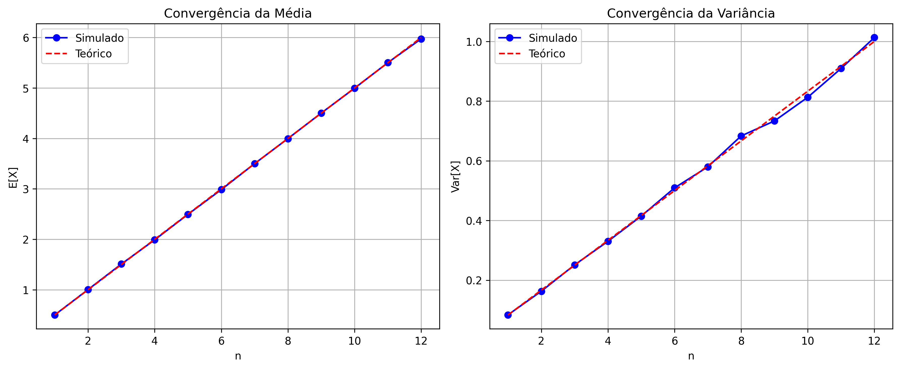

### Distribuições - PDF & CDF para n = [1..12]

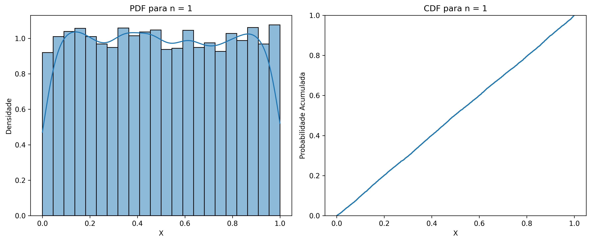
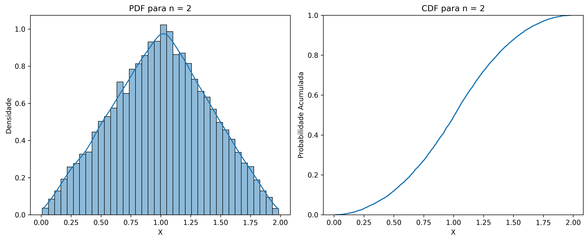
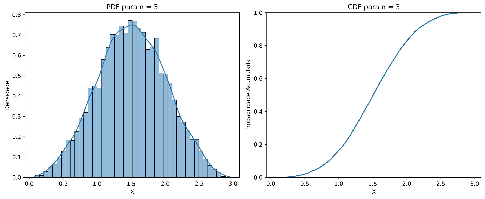
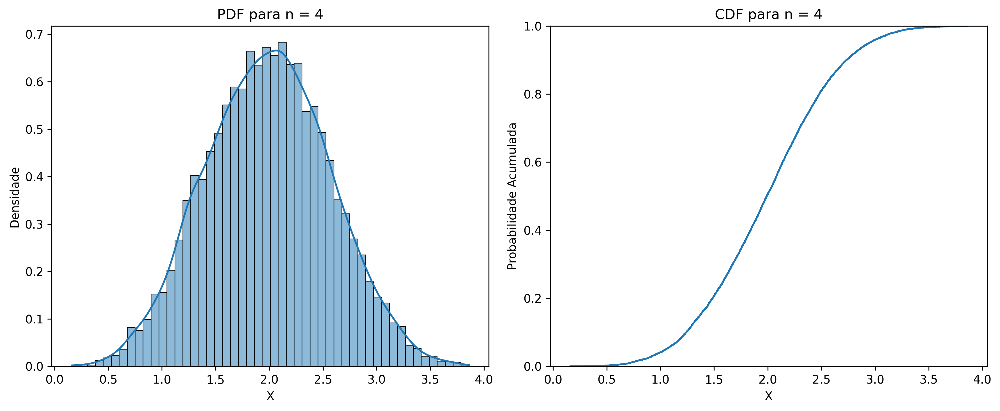
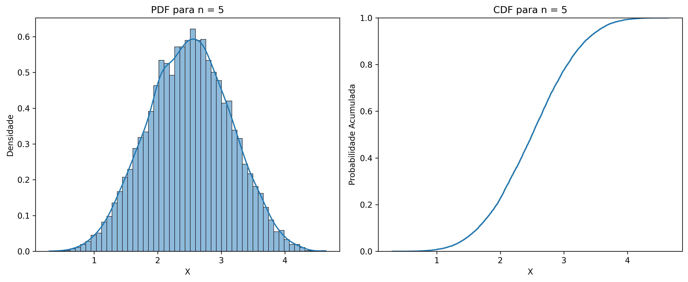
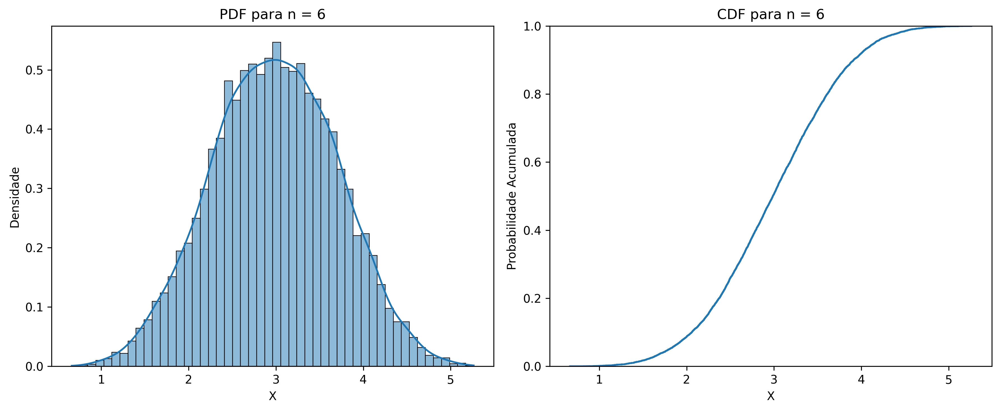
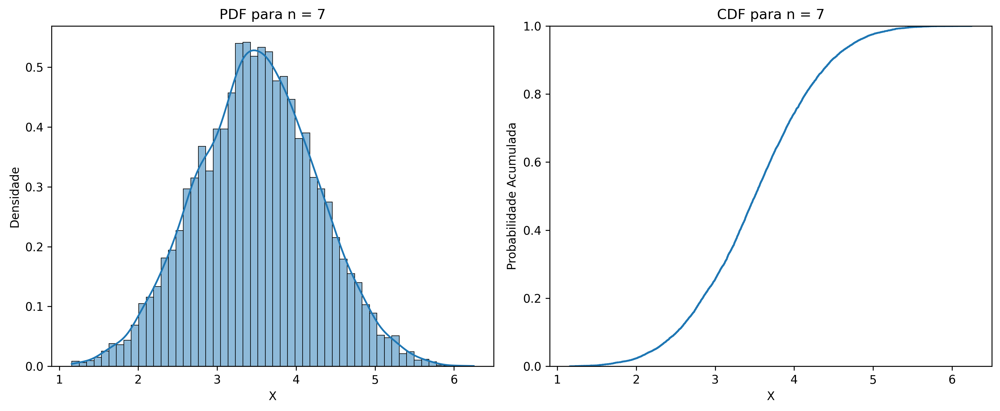
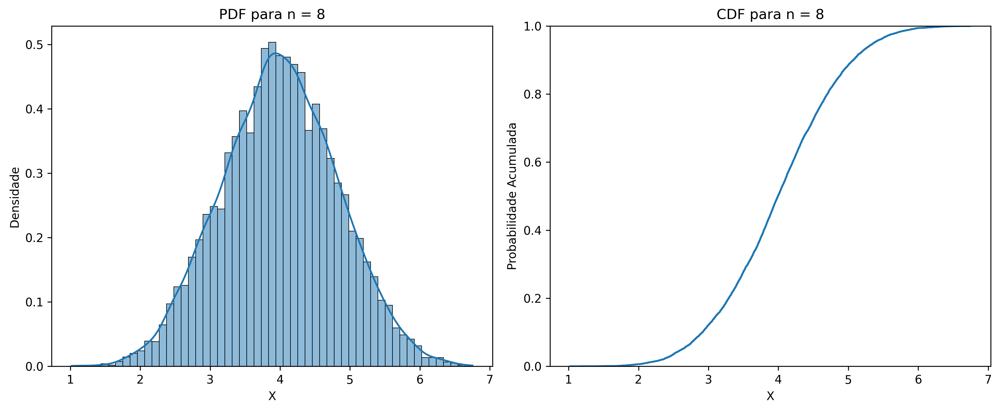
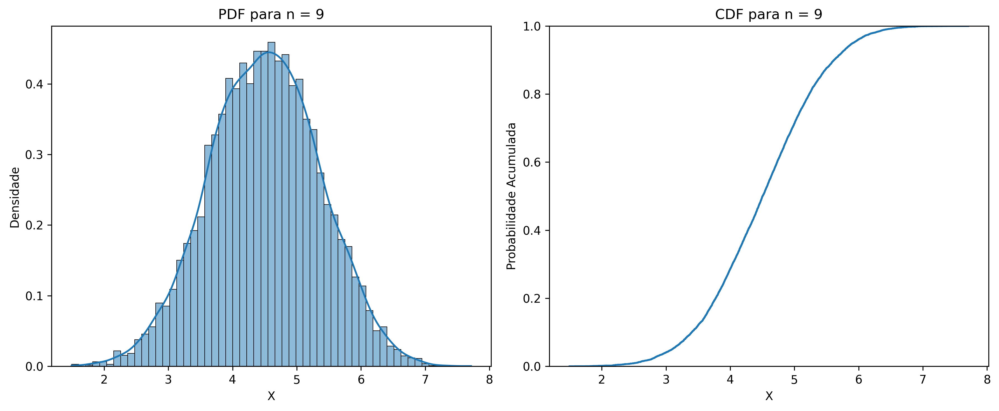
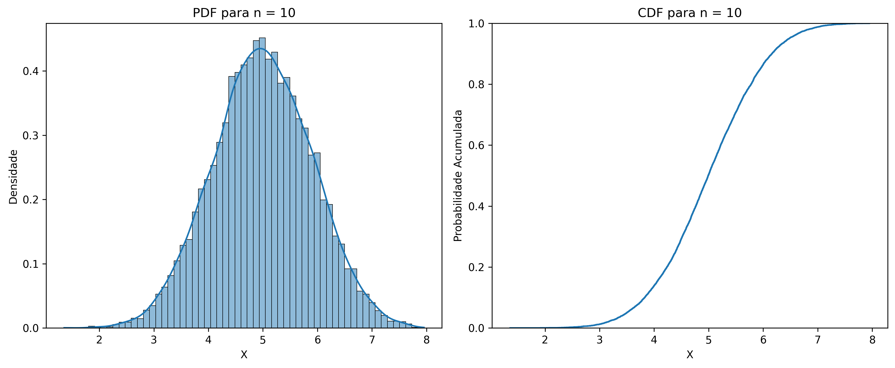

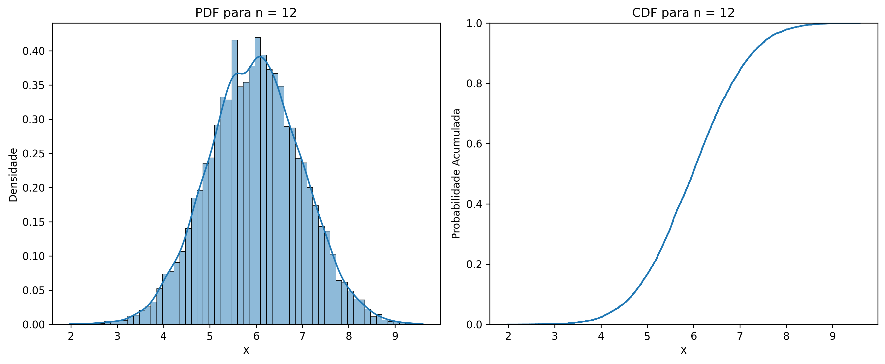