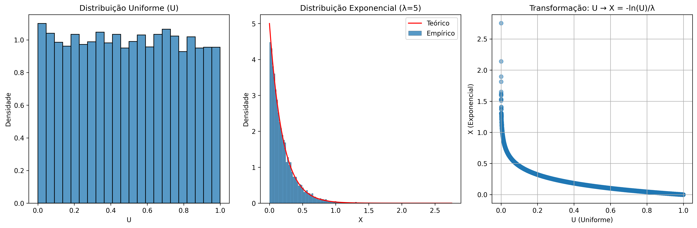

# Questão 3 - Geração de Distribuição Exponencial via Transformação Inversa

## Objetivo

Gerar uma distribuição exponencial a partir de uma distribuição uniforme usando o método da transformação inversa e relacionar com os resultados da Questão 2.

## Metodologia

1. Geração de amostras de uma distribuição uniforme $U(0,1)$
2. Aplicação da transformação inversa: $X = -\frac{ln(U)}{λ}$
3. Comparação com a PDF teórica da exponencial: $f(x) = \lambda e^{-\lambda x}$
4. Análise de estatísticas descritivas (média e variância)

### Valores de λ testados

- $λ = [0.5, 1, 2, 5]$

### Relação com a Questão 2

- Ambas as questões envolvem transformações de variáveis aleatórias
- A Questão 2 usa uma transformação quadrática ($Y = aX² + b$)
- A Questão 3 usa uma transformação logarítmica ($X = -\frac{ln(U)}{λ}$)
- Ambas demonstram como transformações podem gerar novas distribuições a partir da uniforme

## Como Executar

```bash
# em /001-list/q3

python -m venv .venv  
source .venv/bin/activate

pip install -r requirements.txt  

python main.py
```

Os gráficos serão salvos na pasta `outputs/`

## Resultado

Ambas as questões envolvem transformações de variáveis aleatórias. Na [Questão 2](../q2/), usamos $Y = aX² + b$, uma transformação não linear. Na Questão 3, usamos $X = -\frac{ln(U)}{\lambda}$, uma transformação não linear da uniforme. Ambas demonstram como transformações de variáveis podem gerar novas distribuições. A transformação inversa é um método geral para gerar variáveis aleatórias de qualquer distribuição a partir da uniforme, desde que conheçamos a função inversa da *CDF*.

|   λ   |   E[X] (emp)  |  E[X] (teo)  |  Var(X) (emp) | Var(X) (teo) |
|:-----:|:-------------:|:------------:|:-------------:|:------------:|
|  0.5  |  1.9743  |  2.0000  |  3.8396  |  4.0000  |
|  1  |  1.0148  |  1.0000  |  1.0040  |  1.0000  |
|  2  |  0.4911  |  0.5000  |  0.2379  |  0.2500  |
|  5  |  0.2043  |  0.2000  |  0.0425  |  0.0400  |

### Comparação Exponencial

| |
|-|
||
||
||
||
| |

### Q-Q Plot

| | |
|-|-|
|||
|||
| | |