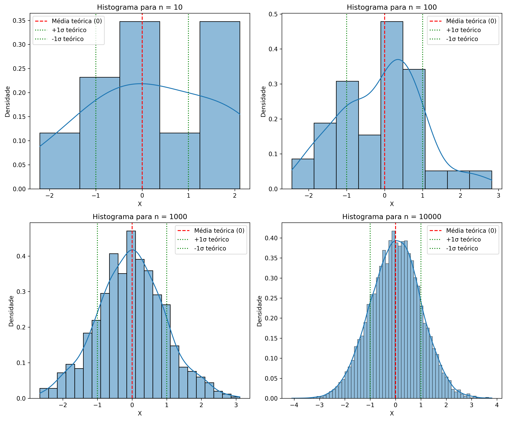
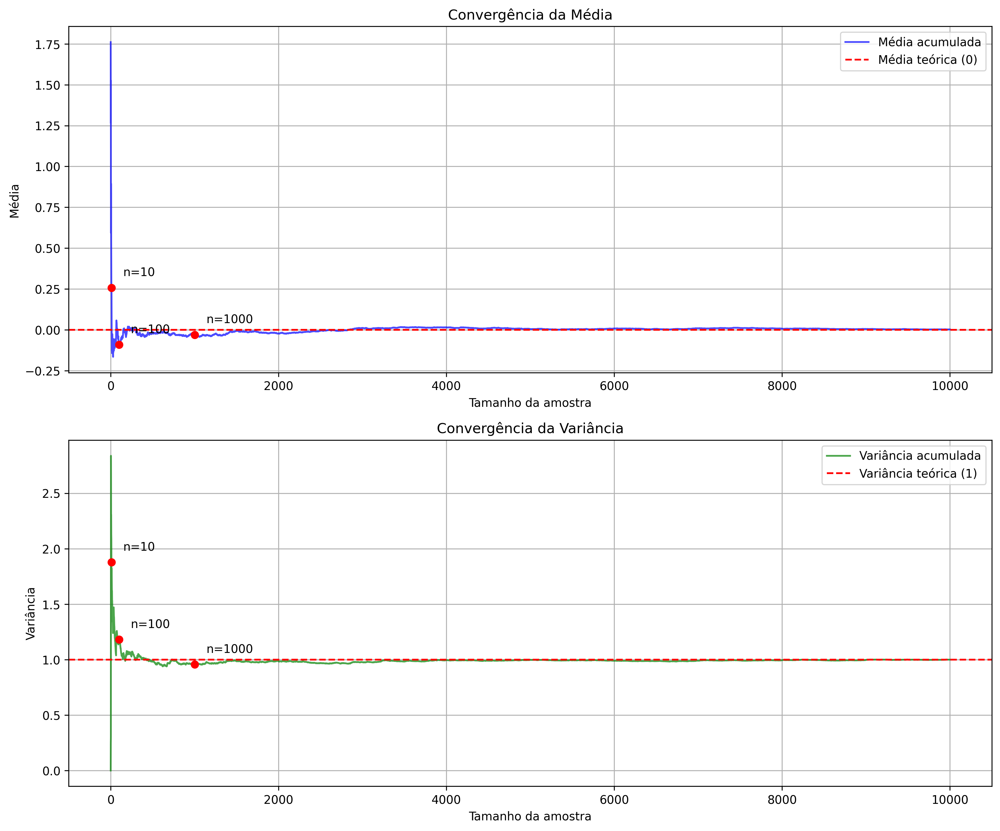
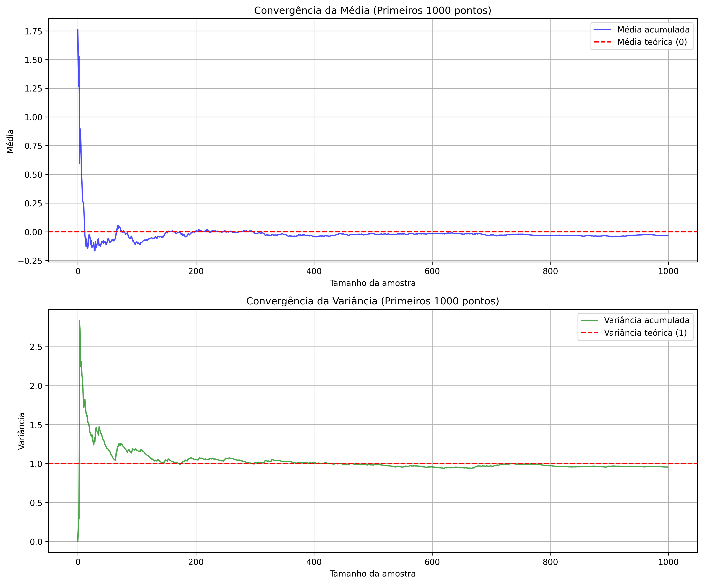

# Questão 4 - Análise de Convergência da Distribuição Normal

## Objetivo

Analisar a convergência de estatísticas (média e variância) de uma distribuição normal padrão à medida que o tamanho da amostra aumenta.

## Metodologia

1. Geração de $10.000$ amostras de uma distribuição normal padrão ($μ=0$, $σ²=1$)
2. Criação de histogramas para diferentes tamanhos de amostra ($10$, $100$, $1000$, $10000$)
3. Cálculo da média e variância acumuladas
4. Visualização da convergência das estatísticas em função do tamanho da amostra

## Como Executar

```bash
# em /001-list/q4

python -m venv .venv  
source .venv/bin/activate

pip install -r requirements.txt  

python main.py
```

Os gráficos serão salvos na pasta `outputs/`

## Resultados

Para amostras pequenas ($n=10$), o histograma pode não parece muito com uma distribuição normal. À medida que $n$ aumenta, o histograma se aproxima cada vez mais da forma da distribuição normal teórica. A *média* e *variância* acumuladas convergem para os valores teóricos ($0$ e $1$) à medida que $n$ aumenta. Para $n$ pequeno, as estatísticas podem variar bastante, mas se estabilizam com amostras maiores. Este é um exemplo claro da Lei dos Grandes Números em ação.

|  n   |   Média   |  Variância  |
|:----:|:---------:|:-----------:|
|   10 |   0.2571 |     1.8780 |
|  100 |  -0.0918 |     1.1806 |
| 1000 |  -0.0304 |     0.9562 |
| 10000 |   0.0022 |     0.9999 |

### Histogramas



### Convergência



