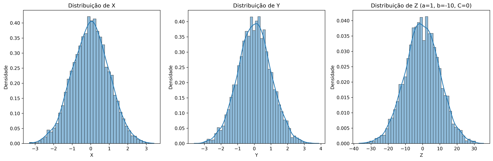

# Questão 5 - Análise da Variável Aleatória $Z = aX + bY + C$

## Objetivo

Analisar a variável aleatória $Z = aX + bY + C$, onde $X$ e $Y$ são variáveis aleatórias normais padrão independentes.

## Metodologia

1. Geração de $5.000$ amostras de $X$ e $Y$ (distribuição normal padrão)
2. Cálculo de $Z = aX + bY + C$ para diferentes valores de $b$ e $C$
3. Cálculo de estatísticas empíricas e teóricas
4. Visualização das distribuições e relações entre variáveis

### Parâmetros testados

- $a = 1$ (fixo)
- $b = [-10, -1, -0.1, 0, 0.1, 1, 10]$
- $C = [0, 5]$

### Estatísticas calculadas

- $Cov(X,Y)$
- $Cov(X,Z)$
- $E[Z]$
- $Var(Z)$

### Relações teóricas

- $Cov(X,Y) = 0$ (devido à independência)
- $Cov(X,Z) = a = 1$
- $E[Z] = C$
- $Var(Z) = a² + b² = 1 + b²$

## Como Executar

```bash
# em /001-list/q5

python -m venv .venv  
source .venv/bin/activate

pip install -r requirements.txt  

python main.py
```

Os gráficos serão salvos na pasta `./outputs/`

## Resultados

$Cov(X,Y)$ é próxima de zero, confirmando a independência entre $X$ e $Y$. $Cov(X,Z)$ é próxima de $1$ (valor de $a$), como esperado teoricamente. $E[Z]$ é próxima de $C$, como esperado teoricamente. $Var(Z)$ é próxima de $1 + b²$, como esperado teoricamente.

Os gráficos de dispersão mostram a relação linear entre $X$ e $Z$. Quando $b = 0$, $Z = X + C$, então a correlação entre $X$ e $Z$ é perfeita ($1$).

Quando $|b|$ aumenta, a variância de $Z$ aumenta quadraticamente com $b$.

|   b   |   C   |  Cov(X,Y) (emp) | Cov(X,Y) (teo) |  Cov(X,Z) (emp) | Cov(X,Z) (teo) |   E[Z] (emp)  |  E[Z] (teo)  |  Var(Z) (emp) | Var(Z) (teo) |
|:-----:|:-----:|:---------------:|:--------------:|:---------------:|:--------------:|:-------------:|:------------:|:-------------:|:------------:|
| -10.0 |   0 | -0.0001         | 0.0000         | 0.9808          | 1.0000         | -0.2195       | 0.0000       | 100.9880      | 101.0000     |
| -10.0 |   5 | -0.0001         | 0.0000         | 0.9808          | 1.0000         | 4.7805        | 5.0000       | 100.9880      | 101.0000     |
|  -1.0 |   0 | -0.0001         | 0.0000         | 0.9803          | 1.0000         | -0.0321       | 0.0000       | 1.9802        | 2.0000       |
|  -1.0 |   5 | -0.0001         | 0.0000         | 0.9803          | 1.0000         | 4.9679        | 5.0000       | 1.9802        | 2.0000       |
|  -0.1 |   0 | -0.0001         | 0.0000         | 0.9803          | 1.0000         | -0.0133       | 0.0000       | 0.9901        | 1.0100       |
|  -0.1 |   5 | -0.0001         | 0.0000         | 0.9803          | 1.0000         | 4.9867        | 5.0000       | 0.9901        | 1.0100       |
|   0.0 |   0 | -0.0001         | 0.0000         | 0.9802          | 1.0000         | -0.0112       | 0.0000       | 0.9801        | 1.0000       |
|   0.0 |   5 | -0.0001         | 0.0000         | 0.9802          | 1.0000         | 4.9888        | 5.0000       | 0.9801        | 1.0000       |
|   0.1 |   0 | -0.0001         | 0.0000         | 0.9802          | 1.0000         | -0.0091       | 0.0000       | 0.9900        | 1.0100       |
|   0.1 |   5 | -0.0001         | 0.0000         | 0.9802          | 1.0000         | 4.9909        | 5.0000       | 0.9900        | 1.0100       |
|   1.0 |   0 | -0.0001         | 0.0000         | 0.9802          | 1.0000         | 0.0096        | 0.0000       | 1.9800        | 2.0000       |
|   1.0 |   5 | -0.0001         | 0.0000         | 0.9802          | 1.0000         | 5.0096        | 5.0000       | 1.9800        | 2.0000       |
|  10.0 |   0 | -0.0001         | 0.0000         | 0.9797          | 1.0000         | 0.1971        | 0.0000       | 100.9857      | 101.0000     |
|  10.0 |   5 | -0.0001         | 0.0000         | 0.9797          | 1.0000         | 5.1971        | 5.0000       | 100.9857      | 101.0000     |

### Histogramas de $Z = aX + bY + C$

| b \ C | 0 | 5 |
|:-----:|:--:|:--:|
| -10   |  |  |
| -1    |    |    |
| -0.1  |  |  |
| 0     |      |      |
| 0.1   |  |  |
| 1     |      |      |
| 10    |    |    |

### Dispersões $X$ vs $Z$

| b \ C | 0 | 5 |
|:-----:|:--:|:--:|
| -10   |  |  |
| -1    |    |    |
| -0.1  |  |  |
| 0     |      |      |
| 0.1   |  |  |
| 1     |      |      |
| 10    |    |    |
